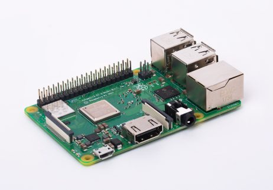
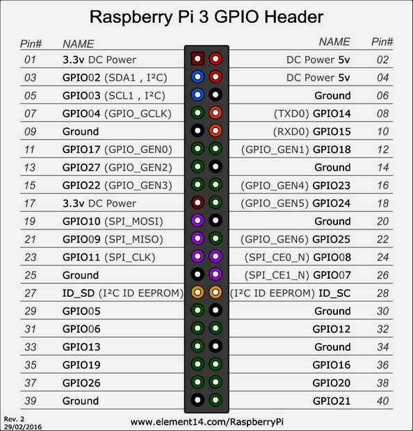

[Raspberry PI's](https://www.raspberrypi.org/) are a convenient cheap
compute platform that allow us to explore create cloud clusters
with various software that otherwise
would not be accessible to most. The point is not to create a complex
compute platform, but to create a *testbed* in which we can explore
configuration aspects and prepare benchmarks that are run on larger
and expensive cloud environments. In addition Raspberry Pis can be used
as a simple Linux terminal to log into other machines.

We will give a small introduction to the platform next.

## Raspberry PI 3 B

Till February 2018 the Raspberry PI 3 B was the newest model. Within
this class we have access to about 100 of them. The Raspberry PI 3 B is shown in @fig:pi3

{#fig:pi3}

The board has the following properties:

* Quad Core 1.2GHz Broadcom BCM2837 64bit CPU
* 1GB RAM
* BCM43438 wireless LAN and Bluetooth Low Energy (BLE) on board
* 40-pin extended GPIO
* 4 USB 2 ports
* 4 Pole stereo output and composite video port
* Full size HDMI
* CSI camera port for connecting a Raspberry Pi camera
* DSI display port for connecting a Raspberry Pi touchscreen display
* Micro SD port for loading your operating system and storing data
* Switched Micro USB power source up to 2.5A

## Raspberry PI 3 B+

We plan to purchase a number of them so we can conduct performance
experiments and leverage the faster hardware. The newest Raspberry PI 3 B+ is shown in @fig:pi3.

{#fig:pi3bplus}

The board has the following properties:

* Broadcom BCM2837B0, Cortex-A53 (ARMv8) 64-bit SoC @ 1.4GHz
* 1GB LPDDR2 SDRAM
* 2.4GHz and 5GHz IEEE 802.11.b/g/n/ac wireless LAN
* Bluetooth 4.2, BLE
* Gigabit Ethernet over USB 2.0 (maximum throughput 300 Mbps)
* Extended 40-pin GPIO header
* Full-size HDMI
* 4 USB 2.0 ports
* CSI camera port for connecting a Raspberry Pi camera
* DSI display port for connecting a Raspberry Pi touchscreen display
* 4-pole stereo output and composite video port
* Micro SD port for loading your operating system and storing data
* 5V/2.5A DC power input
* Power-over-Ethernet (PoE) support (requires separate PoE HAT)

## Raspberry PI Zero

In addition to the PI 3's another interesting platform is the PI Zero,
which is a very low cost system that can serve as IoT board. However
it is also powerful enough to run more sophisticated applications on
it. The newest Raspberry PI Zero is shown in @fig:pizero.

](images/Raspberry-Pi-Zero-462x322.jpg){#fig:pizero}

The board has the following properties:

* 1GHz single-core CPU
* 512MB RAM
* Mini HDMI port
* Micro USB OTG port
* Micro USB power
* HAT-compatible 40-pin header
* Composite video and reset headers
* CSI camera connector (v1.3 only)

## Pin Layout

The PI 3B, 3B+ and Zero come with a number of pins that can be used to
attach sensors. It is convenient to have the pinout available for your
project. Hence we provide a pinout layout in @fig:pi-layout. Other
Pis will have a differnt pinout and you will have to locate them on
the internet.

{#fig:pi-layout}

## Resources

Detailed information about it are available at

* <https://www.raspberrypi.org/documentation/hardware/raspberrypi/README.md>

