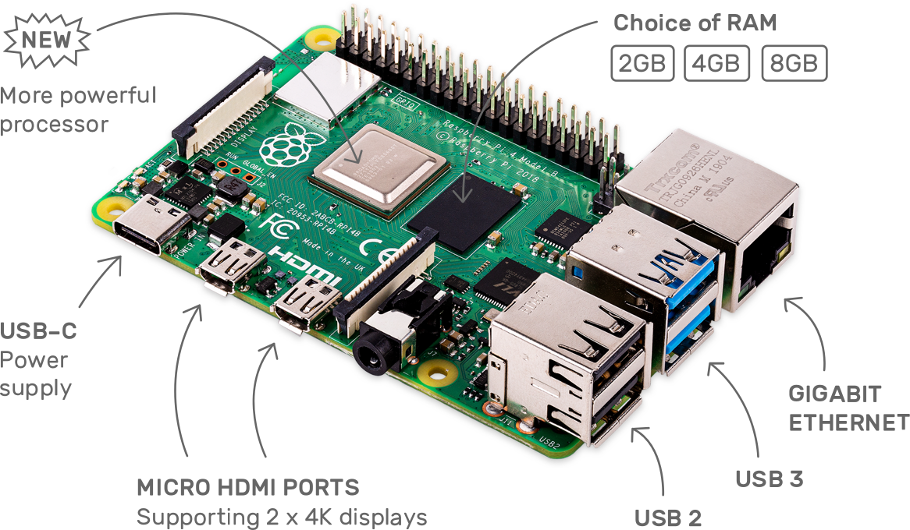

{}
**Learning Objectives**

* Overview of the Pi boards to create Pi clusters.
* Decide which board to get

**Topics covered**

{}

{}

[Raspberry PI's](https://www.raspberrypi.org/) are a convenient cheap
compute platform that allow us to explore create cloud clusters
with various software that otherwise
would not be accessible to most. The point is not to create a complex
compute platform, but to create a *testbed* in which we can explore
configuration aspects and prepare benchmarks that are run on larger
and expensive cloud environments. In addition Raspberry Pis can be used
as a simple Linux terminal to log into other machines.

We will give a small introduction to the platform next.

## Raspberry PI 4B

Figure 1: Pi 4B board

The board has the following properties [^pi4spec]:

* Broadcom BCM2711, Quad core Cortex-A72 (ARM v8) 64-bit SoC @ 1.5GHz
* 2GB, 4GB or 8GB LPDDR4-3200 SDRAM (depending on model)
* 2.4 GHz and 5.0 GHz IEEE 802.11ac wireless, Bluetooth 5.0, BLE
* Gigabit Ethernet
* 2 USB 3.0 ports; 2 USB 2.0 ports.
* Raspberry Pi standard 40 pin GPIO header 
  (fully backwards compatible with previous boards)
* 2 × micro-HDMI ports (up to 4kp60 supported)
* 2-lane MIPI DSI display port
* 2-lane MIPI CSI camera port
* 4-pole stereo audio and composite video port
* H.265 (4kp60 decode), H264 (1080p60 decode, 1080p30 encode)
* OpenGL ES 3.0 graphics
* Micro-SD card slot for loading operating system and data storage
* 5V DC via USB-C connector (minimum 3A*)
* 5V DC via GPIO header (minimum 3A*)
* Power over Ethernet (PoE) enabled (requires separate PoE HAT)
* Operating temperature: 0 – 50 degrees C ambient

Important for the cluster is the following comment:

* A good quality 2.5A power supply can be used if 
  downstream USB peripherals consume less than 500mA in 
  total.

## Raspberry PI 3 B+

We plan to purchase a number of them so we can conduct performance
experiments and leverage the faster hardware. The newest Raspberry 
PI 3 B+ is shown in Figure 2.

Figure 2: Raspberry PI 3B+ board

The board has the following properties:

* Broadcom BCM2837B0, Cortex-A53 (ARMv8) 64-bit SoC @ 1.4GHz
* 1GB LPDDR2 SDRAM
* 2.4GHz and 5GHz IEEE 802.11.b/g/n/ac wireless LAN
* Bluetooth 4.2, BLE
* Gigabit Ethernet over USB 2.0 (maximum throughput 300 Mbps)
* Extended 40-pin GPIO header
* Full-size HDMI
* 4 USB 2.0 ports
* CSI camera port for connecting a Raspberry Pi camera
* DSI display port for connecting a Raspberry Pi touchscreen display
* 4-pole stereo output and composite video port
* Micro SD port for loading your operating system and storing data
* 5V/2.5A DC power input
* Power-over-Ethernet (PoE) support (requires separate PoE HAT)

## Raspberry PI 3 B

Till February 2018 the Raspberry PI 3 B was the newest model. Within
this class we have access to about 100 of them. The Raspberry PI 3 B is shown in 
Figure 3.

Figure 3: Raspberry PI 3 B board

The board has the following properties:

* Quad Core 1.2GHz Broadcom BCM2837 64bit CPU
* 1GB RAM
* BCM43438 wireless LAN and Bluetooth Low Energy (BLE) on board
* 40-pin extended GPIO
* 4 USB 2 ports
* 4 Pole stereo output and composite video port
* Full size HDMI
* CSI camera port for connecting a Raspberry Pi camera
* DSI display port for connecting a Raspberry Pi touchscreen display
* Micro SD port for loading your operating system and storing data
* Switched Micro USB power source up to 2.5A

## Raspberry PI Zero

In addition to the PI 3's another interesting platform is the PI Zero,
which is a very low-cost system that can serve as IoT board. However,
it is also powerful enough to run more sophisticated applications on
it. The newest Raspberry PI Zero is shown in Figure 4.

Figure 4: Raspbery Pi Zero [^pizero]

The board has the following properties:

* 1GHz single-core CPU
* 512MB RAM
* Mini HDMI port
* Micro USB OTG port
* Micro USB power
* HAT-compatible 40-pin header
* Composite video and reset headers
* CSI camera connector (v1.3 only)

## Pin Layout

The PI 4B, 3B+, 3B, and Zero come with a number of pins that can be used to
attach sensors. It is convenient to have the pinout available for your
project. Hence, we provide a pinout layout in Figure 5. Other
Pis will have a different pinout and you will have to locate them on
the internet.

Figure 5. Pi pinout

## Mounting diagram

In case you need to drill wholes in cases or plexiglas for mounting, the 
following mounting diagram is very useful:

* [Mounting Diagram in PDF](https://www.raspberrypi-spy.co.uk/wp-content/uploads/2012/11/Raspberry-Pi-Mounting-Hole-Template.pdf)

## Resources

Detailed information about it are available at

* <https://www.raspberrypi.org/documentation/hardware/raspberrypi/README.md>

[^pi4spec]: Raspberry Pi 4 Model B specifications, 
            https://www.raspberrypi.org/products/raspberry-pi-4-model-b/specifications

[^pizero]: Raspberry Pi Zero, https://www.raspberrypi.org/products/raspberry-pi-zero

