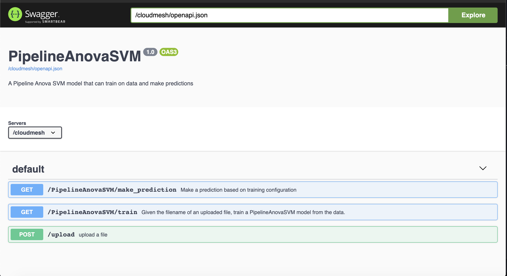
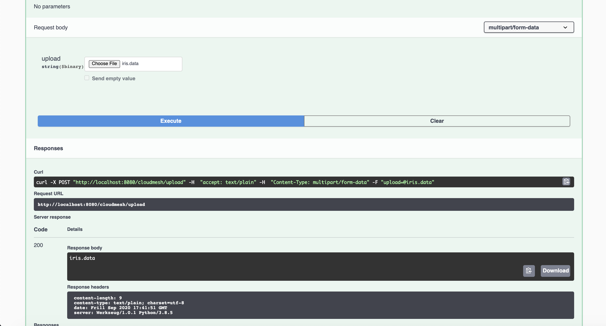
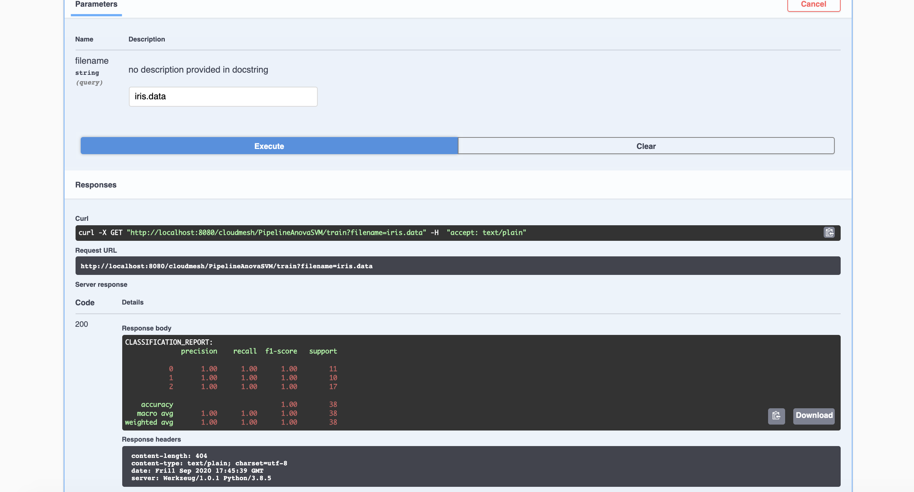
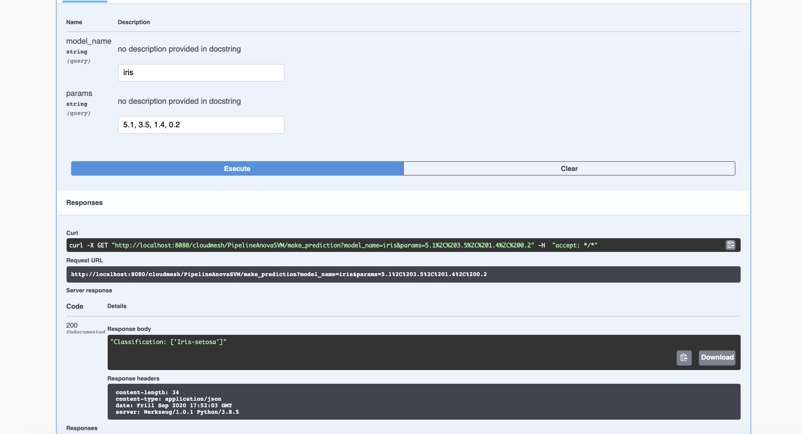

{}

**Learning Objective**

We will learn to create a REST service automatically from pyton functionsq with the 
help of cloudmesh-openapi. We use as example a Pipeline Anova SVM from which we generate 
an  openapi server, and subsequently train the model 
with data and make predictions from said data. All code needed for 
this is provided in the [cloudmesh-openapi](https://github.com/cloudmesh/cloudmesh-openapi) 
repository. The code is largely based on this
[sklearn example](https://scikit-learn.org/stable/auto_examples/feature_selection/plot_feature_selection_pipeline.html). This
includes

* Training ML models with stateless requests
* Generating RESTful APIs using `cms openapi` for existing python code 
* Deploying openapi definitions onto a localserver
* Interacting with newly created openapi services

**Topics Covered**



{}


## 1. Prerequisite

It is also assumed that the user has installed and has familiarity with the following:

* Install cloudmesh-openapi using the developer install as documented [here](https://github.com/cloudmesh/cloudmesh-openapi)
* Python 3.8.x
* Linux Command line
* Working in a python environment


## 2. The Python Code

First, let us ensure we are in the correct directory. If you followed
the cloudmesh-openapi installation directions as dictated in the
[installation guide](https://github.com/cloudmesh/cloudmesh-openapi),
simply navigate to the root directory of `cloudmesh-openapi`. Notice
how we are still working in our python virtual environment `ENV3` from
the installation guide.

```
(ENV3) > pwd
~/cm/cloudmesh-openapi
```

Let us take a look at the PipelineAnova SVM example code.

A
[Pipeline](https://scikit-learn.org/stable/modules/generated/sklearn.pipeline.Pipeline.html)
is a *pipeline* of transformations to apply with a final
estimator. Analysis of variance
([ANOVA](https://en.wikipedia.org/wiki/Analysis_of_variance)) is used
for feature selection. A Support vector machine
[SVM](https://en.wikipedia.org/wiki/Support_vector_machine) is used as
the actual learning model on the features.


Use your favorite editor to look at it (whether it be vscode, vim,
nano, etc). We will use emacs
```
(ENV3) > emacs ./tests/Scikitlearn-experimental/sklearn_svm.py
```

The class within this file has two main methods to interact with (except for 
the file upload capability which is added at runtime)

```
@classmethod
def train(cls, filename: str) -> str:
    """
    Given the filename of an uploaded file, train a PipelineAnovaSVM
    model from the data. Assumption of data is the classifications 
    are in the last column of the data.

    Returns the classification report of the test split
    """
    # some code...

@classmethod
def make_prediction(cls, model_name: str, params: str):
    """
    Make a prediction based on training configuration
    """
    # some code...
```

Note the parameters that each of these methods takes in. These
parameters are expected as part of the stateless request for each
method.

## 3. Generating the OpenAPI YAML file

Let us now use the python code from above to create the openapi YAML
file that we will deploy onto our server. To correctly generate this
file, use the following command:
```
(ENV3) > cms openapi generate PipelineAnovaSVM 
    \ --filename=./tests/Scikitlearn-experimental/sklearn_svm.py
    \ --import_class
    \ --enable_upload
```
Let us digest the options we have specified:

* `--filename` indicates the path to the python file in which our code
  is located
* `--import_class` notifies `cms openapi` that the YAML file is generated 
  from a class. The name of this class is specified as
  `PipelineAnovaSVM`
* `--enable_upload` allows the user to upload files to be stored on
  the server for reference. This flag causes `cms openapi` to
  auto-generate a new python file with the `upload` method appended to
  the end of the file. For this example, you will notice a new file
  has been added in the same directory as `sklearn_svm.py`. The file
  is aptly called: `sklearn_svm_upload-enabled.py`

## 4. The OpenAPI YAML File (optional) 

If Section 2 above was correctly, cms will have generated the
corresponding openapi YAML file. Let us take a look at it.

```
(ENV3) > emacs ./tests/Scikitlearn-experimental/sklearn_svm.yaml
```

This YAML file has a lot of information to digest. The basic structure
is documented
[here](https://swagger.io/docs/specification/basic-structure/). However,
it is not necessary to understand this information to deploy RESTful
APIs.

However, take a look at `paths:` on line 9 in this file. Under this
section, we have several different endpoints for our API
listed. Notice the correlation between the endpoints and the python
file we generated from.

## 5. Starting the Server

Using the YAML file from Section 2, we can now start the server.

```
(ENV3) > cms openapi server start ./tests/Scikitlearn-experimental/sklearn_svm.yaml
```

The server should now be active. Navigate to
[http://localhost:8080/cloudmesh/ui](http://localhost:8080/cloudmesh/ui).



## 6. Interacting With the Endpoints

### 6.1 Uploading the Dataset

We now have a nice user inteface to interact with our newly generated
API. Let us upload the data set. We are going to use the iris data set
in this example. We have provided it for you to use. Simply navigate
to the `/upload` endpoint by clicking on it, then click Try it out.

We can now upload the file. Click on Choose File and upload the data
set located at `./tests/Scikitlearn-experimental/iris.data`. Simply
hit Execute after the file is uploaded. We should then get a `200`
return code (telling us that everything went ok).



### 6.2 Training on the Dataset

The server now has our dataset. Let us now navigate to the `/train`
endpoint by, again, clicking on it. Similarly, click `Try it out`. The
parameter being asked for is the filename. The filename we are
interested in is iris.data. Then click execute. We should get another
`200` return code with a Classification Report in the Response Body.



### 6.3 Making Predictions

We now have a trained model on the iris data set. Let us now use it to
make predictions. The model expects 4 attribute values: sepal length,
seapl width, petal length, and petal width. Let us use the values
`5.1, 3.5, 1.4, 0.2` as our attributes. The expected classification is
`Iris-setosa`.

Navigate to the `/make_prediction` endpoint as we have with other
endpoints. Again, let us `Try it out`. We need to provide the name of
the model and the params (attribute values). For the model name, our
model is aptly called `iris` (based on the name of the data set).



As expected, we have a classification of `Iris-setosa`. 

## 7. Clean Up (optional)

At this point, we have created and trained a model using `cms
openapi`. After satisfactory use, we can shut down the server. Let us
check what we have running.

```
(ENV3) > cms openapi server ps
openapi server ps

INFO: Running Cloudmesh OpenAPI Servers

...

[{'name': 'sklearn_svm', 'pid': 7496, 'spec': './tests/Scikitlearn-experimental/sklearn_svm.yaml'}]
+-------------+------+--------------------------------------------------+
| name        | pid  | spec                                             |
+-------------+------+--------------------------------------------------+
| sklearn_svm | 7496 | ./tests/Scikitlearn-                             |
|             |      | experimental/sklearn_svm.yaml                    |
+-------------+------+--------------------------------------------------+
```

We can stop the server with the following command:

```
(ENV3) > cms openapi server stop sklearn_svm
```

We can verify the server is shut down by running the `ps` command again.

```
(ENV3) > 
openapi server ps

INFO: Running Cloudmesh OpenAPI Servers

[]
None
```

## 8. Assignments

Many ML models follow the same basic process for training and testing:

1. Upload Training Data
2. Train the model
3. Test the model

Using the PipelineAnovaSVM code as a template, write python code for a
new model and deploy it as a RESTful API as we have done above. Train
and test your model using the provided iris data set. There are plenty
of examples that can be referenced
[here](https://scikit-learn.org/stable/auto_examples/index.html#)

## 9. References

* [SciKit-Learn: Machine learning in Python, 0.24.1, Feb 2021](https://scikit-learn.org/stable/)


